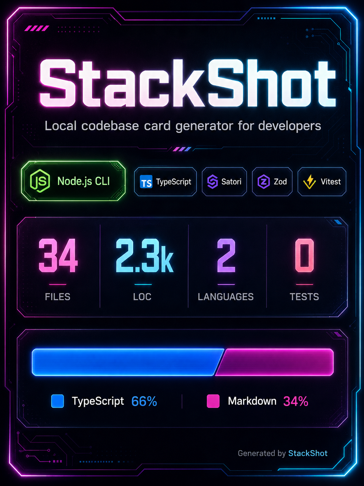

# StackShot



StackShot is an agent skill that scans a repository and generates a polished image-generation prompt for a tech stack card.

It collects project metadata, framework and language signals, file counts, LOC, tests, key tools, language breakdown, and optional repo styling guidance.

Want to copy/paste the prompt manually? Open [STACKSHOT.md](STACKSHOT.md).

[](#codex)
[](#claude)
[](STACKSHOT.md)

## Install As A Skill

### Codex

```bash
mkdir -p "${CODEX_HOME:-$HOME/.codex}/skills/stackshot" \
  && curl -fsSL https://raw.githubusercontent.com/rafsuntaskin/stackshot/main/STACKSHOT.md \
  -o "${CODEX_HOME:-$HOME/.codex}/skills/stackshot/SKILL.md"
```

Start a new Codex session after installing.

Installed path:

```text
~/.codex/skills/stackshot/SKILL.md
```

### Claude

For Claude Code:

```bash
mkdir -p "$HOME/.claude/skills/stackshot" \
  && curl -fsSL https://raw.githubusercontent.com/rafsuntaskin/stackshot/main/STACKSHOT.md \
  -o "$HOME/.claude/skills/stackshot/SKILL.md"
```

Start a new Claude Code session after installing.

Installed path:

```text
~/.claude/skills/stackshot/SKILL.md
```

### Manual Copy

Download or copy [STACKSHOT.md](STACKSHOT.md), then save it as `SKILL.md` in your assistant's skill directory:

```text
skills/stackshot/SKILL.md
```

## Marketplace

StackShot is listed in the `rafsuntaskin/ai-plugins` marketplace for discovery:

```bash
codex plugin marketplace add rafsuntaskin/ai-plugins
```

Current Codex CLI versions register marketplaces from the terminal, but do not expose a `codex plugin add <plugin>` command. Use the Codex skill install command above for now.

```text
github:rafsuntaskin/stackshot
```

## Usage

Ask Codex something like:

```text
Use StackShot to generate a tech stack card prompt for this repo.
```

or:

```text
Generate a dark glass StackShot card prompt for this project.
```

If your agent supports plugin slash commands, use:

```text
/stackshot
```

or with a style and format:

```text
/stackshot minimal wide
```

Skills are usually model-invoked: the agent decides to use StackShot when your request matches the skill description. The slash command is a convenience wrapper that explicitly asks the agent to run the StackShot workflow.

StackShot scans the current repository and collects:

- Project name
- Primary framework and language
- Key tools and dependencies
- Source file count
- Lines of code
- Test count
- Top language breakdown
- Optional brand or design-system styling signals

If you do not specify a style, StackShot asks you to choose one:

```text
default
dark glass
neon
minimal
brutalist
cyberpunk
terminal
```

Use `default` when you want StackShot to inspect the repository's own CSS, theme files, design tokens, assets, README, or brand docs and infer a visual direction.

If you do not specify a format, StackShot asks whether you want:

```text
wide
portrait
```

Use `wide` for a 1200x630 landscape card. Use `portrait` for a 900x1600 mobile-friendly vertical card that reads well in Facebook feeds.

Example prompts:

```text
Use StackShot for this repo and use the default style.
```

```text
Generate a minimal wide StackShot prompt for this project.
```

```text
Scan this repository and create a cyberpunk portrait tech stack card prompt.
```

```text
Use StackShot, but set the project name to "Acme Dashboard".
```

The skill outputs a final image-generation prompt for a wide or portrait tech stack card. Paste that prompt into your preferred image model or image-generation tool.

## Marketplace Repository

StackShot is listed in:

```text
rafsuntaskin/ai-plugins
```

The marketplace file is:

```text
.claude-plugin/marketplace.json
```
